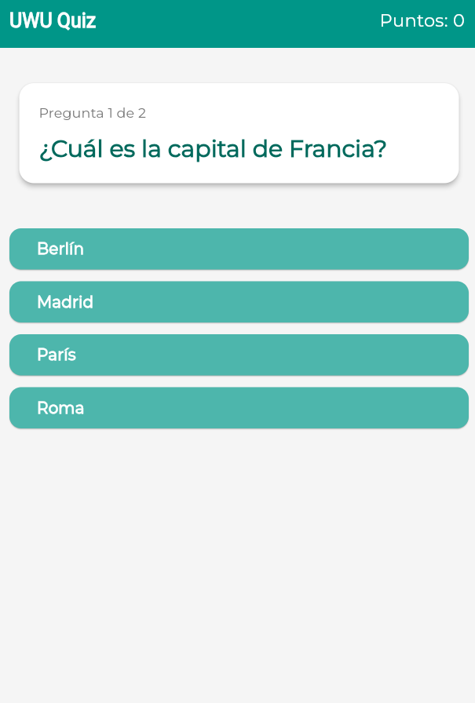
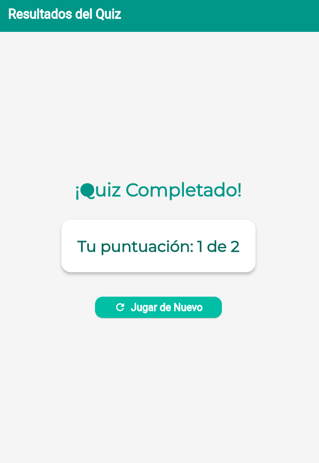

# Game Guiz 🎮 (UWU Quiz Game)

Un divertido juego de preguntas y respuestas desarrollado con Flutter. ¡Pon a prueba tus conocimientos!

[](https://flutter.dev)
[](https://dart.dev)
[](https://pub.dev/packages/provider)

## 🌟 Características

*   Múltiples preguntas de opción múltiple.
*   Puntuación en tiempo real.
*   Feedback visual inmediato para respuestas correctas e incorrectas.
*   Pantalla de resultados al finalizar el quiz.
*   Opción para jugar de nuevo.
*   Interfaz de usuario limpia y atractiva con un tema personalizado (`AppTheme`).
*   Gestión de estado eficiente utilizando el paquete `provider`.
*   Widgets reutilizables para una mejor organización del código.

## 📸 Screenshots

*(Aquí algunas capturas de pantalla de la aplicación! como pantalla de inicio del quiz, una pregunta, pantalla de resultados.)*

**Ejemplo:**
| Pantalla de Quiz                                     | Pantalla de Resultados                                  |
| :--------------------------------------------------: | :---------------------------------------------------: |
|  |  |

## 🏗️ Estructura del Proyecto

El proyecto sigue una estructura organizada para facilitar la mantenibilidad y escalabilidad:

```
lib/
├── constants/
│ └── app_theme.dart # Definición del tema visual de la aplicación.
├── models/
│ └── question_model.dart # Modelo de datos para las preguntas del quiz.
├── providers/
│ └── quiz_provider.dart # Lógica central del quiz y gestión de estado con ChangeNotifier.
├── screens/
│ ├── quiz_page.dart # Pantalla principal donde se juega el quiz.
│ └── results_page.dart # Pantalla que muestra los resultados finales del quiz.
├── widgets/
│ ├── option_button.dart # Widget reutilizable para los botones de opción de respuesta.
│ └── question_display.dart# Widget reutilizable para mostrar el texto de la pregunta.
└── main.dart # Punto de entrada de la aplicación Flutter.
test/
└── widget/
└── quiz_page_test.dart # Pruebas de widgets para la QuizPage.
```

## 🛠️ Tecnologías Utilizadas

*   **Flutter:** Framework de UI para construir aplicaciones compiladas nativamente para móvil, web y escritorio desde una única base de código.
*   **Dart:** Lenguaje de programación optimizado para clientes para construir aplicaciones rápidas en cualquier plataforma.
*   **Provider:** Paquete para la gestión de estado, utilizado aquí para manejar el estado del quiz de forma reactiva y eficiente.
*   **flutter_test:** Framework para escribir pruebas unitarias y de widgets en Flutter.

## 🚀 Cómo Empezar

Sigue estos pasos para ejecutar el proyecto localmente:

1.  **Prerrequisitos:**
    *   Asegúrate de tener [Flutter SDK](https://flutter.dev/docs/get-started/install) (versión recomendada: 3.x o superior) instalado en tu máquina.
    *   Un editor de código como VS Code o Android Studio con los plugins de Flutter y Dart.

2.  **Clonar el Repositorio:**
    ```bash
    git clone https://github.com/TU_USUARIO/game_guiz.git
    cd game_guiz
    ```
    *(Reemplaza `TU_USUARIO` con tu nombre de usuario de GitHub si estás forkeando y clonando tu fork)*

3.  **Instalar Dependencias:**
    ```bash
    flutter pub get
    ```

4.  **Configurar la Fuente (Montserrat):**
    *   La aplicación utiliza la fuente `Montserrat`. Asegúrate de que los archivos de la fuente (ej. `Montserrat-Regular.ttf`, `Montserrat-Bold.ttf`) estén presentes en la carpeta `assets/fonts/` (créala si no existe en la raíz de tu proyecto).
    *   Verifica que tu archivo `pubspec.yaml` incluya la referencia a la fuente:
        ```yaml
        # pubspec.yaml
        flutter:
          uses-material-design: true

          assets:
            - assets/fonts/ # Asegúrate de que esta línea exista para que se reconozca la carpeta

          fonts:
            - family: Montserrat
              fonts:
                - asset: assets/fonts/Montserrat-Regular.ttf
                - asset: assets/fonts/Montserrat-Bold.ttf
                  weight: 700
                # Añade otras variantes (Light, Medium, etc.) si las usas en AppTheme
        ```
    *   Si realizaste cambios en `pubspec.yaml`, vuelve a ejecutar `flutter pub get`.

5.  **Ejecutar la Aplicación:**
    ```bash
    flutter run
    ```
    Selecciona un emulador, simulador o dispositivo físico conectado para ver la aplicación en acción.

## ✅ Pruebas (Testing)

El proyecto incluye pruebas de widgets para `QuizPage` ubicadas en `test/widget/quiz_page_test.dart`.

Para facilitar las pruebas, el `QuizProvider` ha sido modificado para permitir la inyección de una lista de preguntas a través de su constructor. Esto permite usar datos mock controlados durante las pruebas:

```dart
// En quiz_provider.dart
class QuizProvider with ChangeNotifier {
  final List<Question> _questions;
  // ...
  QuizProvider({List<Question>? questions})
      : _questions = questions ?? _defaultQuestions {
    // ...
  }
  // ...
}

// En quiz_page_test.dart (ejemplo de uso)
final mockQuestionsList = [ /* ... tus preguntas mock ... */ ];

Widget createQuizPageTestWidget({QuizProvider? provider}) {
  return ChangeNotifierProvider<QuizProvider>(
    create: (_) => provider ?? QuizProvider(questions: mockQuestionsList),
    child: MaterialApp(
      theme: AppTheme.lightTheme,
      home: const QuizPage(),
      // ...
    ),
  );
}